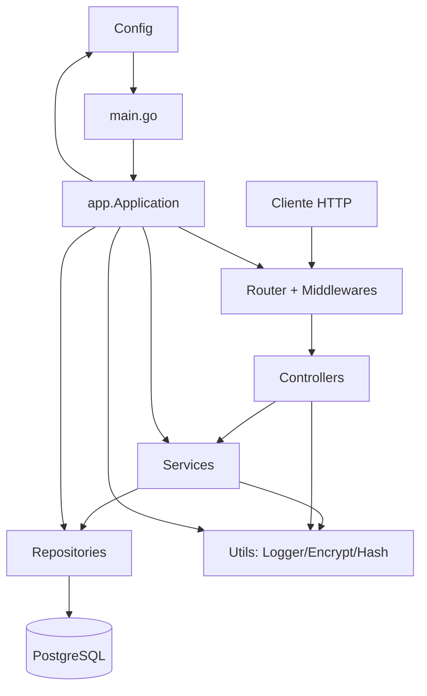
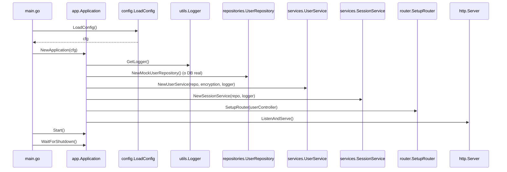
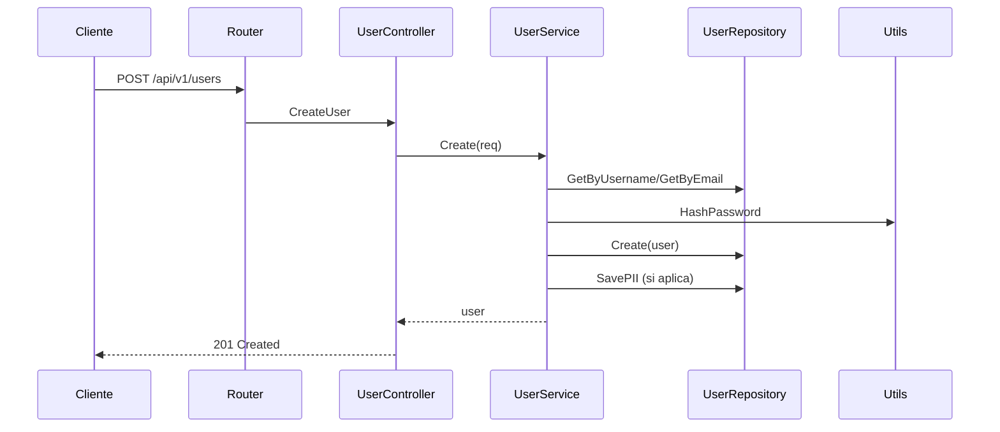
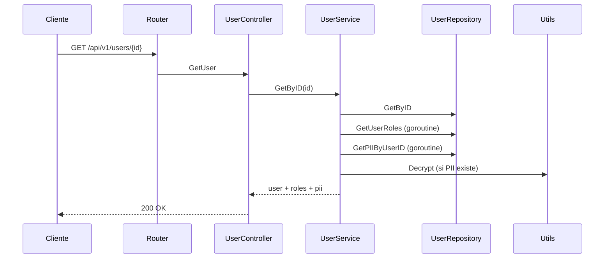
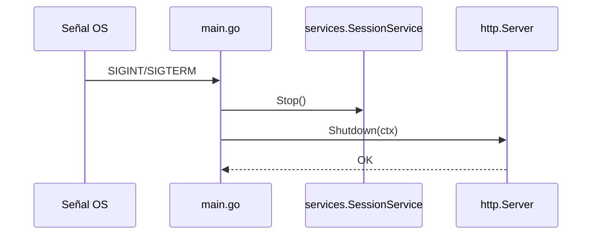

# Arquitectura y flujo de ejecución

Este documento describe la arquitectura de la aplicación y el flujo de ejecución principal.

## Resumen de arquitectura

La aplicación sigue una arquitectura por capas con separación clara de responsabilidades:

- **Router**: define endpoints HTTP y middlewares.
- **Controllers**: validan entrada HTTP, delegan lógica de negocio y formatean respuestas.
- **Services**: contienen la lógica de negocio (validaciones, hash/encriptación, concurrencia).
- **Repositories**: capa de acceso a datos (DB real o mock).
- **Utils**: utilidades transversales (logger, encriptación, hash de passwords).
- **Config**: carga de configuración desde variables de entorno.
- **App**: orquesta la inicialización de componentes y el ciclo de vida de la aplicación.

### Diagrama de capas (alto nivel)

## Componentes principales

### Punto de entrada

El punto de entrada es `main.go`, que ahora es mínimo y delega a `app.Application`:

1. Carga configuración (`config.LoadConfig`).
2. Crea la aplicación (`app.NewApplication`).
3. Inicia la aplicación (`app.Start`) y espera el apagado (`app.WaitForShutdown`).

Dentro de `app/Application`, se realiza:
- Inicialización de logger y repositorio.
- Creación de servicios y controladores.
- Configuración del router y servidor HTTP.
- Manejo del apagado graceful.

### Router

`router.SetupRouter` define rutas REST para usuarios, roles, sesiones y health check.

### Controller

`UserController` valida payload y parámetros, y delega a `UserService` / `SessionService`.

### Services

`UserService` encapsula la lógica de negocio: validaciones, hashing de passwords, encriptación de PII, concurrencia al cargar roles/PII.

`SessionService` maneja sesiones y una goroutine para limpieza periódica de sesiones expiradas.

### Repository

`UserRepository` define la interfaz. La implementación real usa PostgreSQL; por defecto se usa `MockUserRepository` en `main.go`.

## Flujo de ejecución

### Arranque de la aplicación

### Flujo de una request (crear usuario)

### Flujo de lectura de usuario

### Apagado graceful

## Notas de configuración

- En producción se exige `ENCRYPTION_KEY`, `JWT_SECRET` y `DB_PASSWORD` no por defecto (validado en `config.LoadConfig`).
- Por defecto se usa repositorio mock para facilitar pruebas sin base de datos.

## Archivos clave

- `main.go`: punto de entrada mínimo, carga config y delega a `app.Application`.
- `app/application.go`: orquestación de dependencias y ciclo de vida.
- `router/router.go`: rutas HTTP y middlewares.
- `controllers/user_controller.go`: capa HTTP.
- `services/user_service.go`: lógica de negocio de usuarios.
- `services/session_service.go`: lógica de sesiones.
- `repositories/user_repository.go`: acceso a datos.
- `config/config.go`: carga/validación de configuración.
